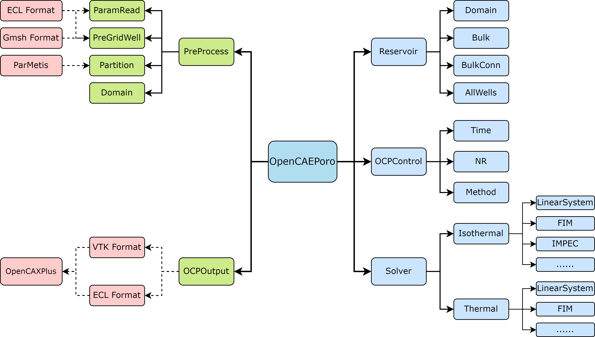

# OpenCAEPoro
<div style="text-align: justify;">

OpenCAEPoro is an open-source parallel numerical simulation software for simulating multiphase and multicomponent flows in porous media. It is built using C++ and incorporates MPI parallelism to enhance its performance and scalability. OpenCAEPoro utilizes a set of general-purpose compositional model equations, enabling it to handle a diverse range of fluid dynamics, including the black oil model, compositional model, and thermal recovery models. OpenCAEPoro establishes a unified solving framework that integrates many widely used methods, such as IMPEC, FIM, and AIM. This framework allows dynamic collaboration between different methods.

OpenCAEPoro is constructed based on object-oriented modular principles and contains five major components at the top level:

1. **`PreProcess` module**: It is responsible for inputting discrete grids and reservoir parameters, as well as performing parallel grid partitioning and redistribution of reservoir information. OpenCAEPoro supports reading input files with ECL-style keywords and unstructured grids in the Gmsh format. Additionally, ParMetis is employed for grid partitioning when necessary.

2. **`Reservoir` module**: It contains physical information related to the reservoir, which can be categorized into three parts: information specific to individual grid cells (e.g. PVT calculations), interactions between grid cells (e.g. flux calculations), and interactions between grid cells and wells (e.g. well models). They correspond to the `Bulk` module, the `BulkConn` module, and the `AllWells` module, respectively. Additionally, the \texttt{Domain} module stores information needed by inter-process communications.

3. **`Solver` module**: It accommodates solvers for isothermal and non-isothermal processes. A variety of solution methods, such as IMPEC and FIM, are implemented. The `Solver` module provides a cohesive interface for the these solvers, which, in turn, establish a unified framework for all underlying solution methods. 

4. **`OCPControl` module**: It manages the simulation process through two types of controls: operational control and solution control. Operational control focuses on aspects independent of the solution process, such as maximal runtime duration; Solution control encompasses the prediction of time steps, management of nonlinear iterations, as well as the selection of solution methods. 

5. **`OCPOutput` module**: It prints the designated results for subsequent visualization and data analysis. These results are generated at each time step or according to a specified time interval. Currently, OpenCAEPoro supports outputting result files in ECL style and VTK format.

#### Top-Level Architecture diagram


Key features of the simulator include:

- General-purpose compositional model equations: supports diverse fluid dynamics, including black oil, compositional, and thermal recovery models.

- Unified solving framework: accommodates widely used methods like IMPEC, FIM, and AIM, enabling dynamic collaboration between different techniques.
- General domain decomposition-based methods: supports adaptively coupled solutions between subdomains.
- Object-oriented programming design: modularizes the computations of the physical objects and processes.
- Mesh diversity: orthogonal grids, corner-point grids, and meshs in [Gmsh](https://gmsh.info/) format.

- Linear solver-friendly: currently supports [FASP](https://github.com/FaspDevTeam/faspsolver), [PARDISO](https://www.intel.com/content/www/us/en/docs/onemkl/developer-reference-c/2023-0/onemkl-pardiso-parallel-direct-sparse-solver-iface.html), and [PETSc](https://petsc.org/release/).
- Cross-platform: supports Linux, Windows, and macOS.

---

# Table of Contents

- [Dependencies](#dependencies)
- [Quickstart for Linux Systems](#Quickstart-linux)
  - [Requirements](#requirements-linux)
  - [Build Dependencies](#build-dependencies-linux)
  - [Build OpenCAEPoro](#build-opencaeporox-linux)
  - [Running examples](#running-examples-linux)
- [Quickstart for Windows Systems](#quickstart-windows)
  - [Requirements](#requirements-windows)
  - [Build OpenCAEPoro](#build-opencaeporox-windows)
- [License](#license)

---

# Dependencies

- **(required)** BLAS, LAPACK: e.g., [LAPACK-3.11](https://netlib.org/lapack/lapack-3.11.0.html) - necessary mathematical libraries.
- **(required)** [ParMETIS](http://glaros.dtc.umn.edu/gkhome/metis/parmetis/overview) - parallel library for partitioning unstructured graphs and meshes, optimizing the performance of large-scale parallel computations.
- **(optional)** [Hypre](https://github.com/hypre-space/hypre) - high-performance library that provides scalable linear solvers and preconditioners for large-scale scientific computation.
- **(optional)** [PETSc](https://web.cels.anl.gov/projects/petsc/vault/petsc-3.19/docs/install/download.html) - scalable library for the parallel solution of linear and nonlinear equations, widely used in scientific and engineering applications.

- **(optional)** [FASP](https://github.com/FaspDevTeam/faspsolver) - package designed to develop and test efficient solvers and preconditioners for discrete partial differential equations (PDEs),
- **(optional)** [PARDISO](https://www.intel.com/content/www/us/en/docs/onemkl/developer-reference-c/2023-0/onemkl-pardiso-parallel-direct-sparse-solver-iface.html) - high-performance, robust, memory efficient, and easy to use software package for solving large sparse linear systems of equations on shared memory multiprocessors.
- **(optional)** [AdaptiveSolver](https://gitee.com/zhaoli0321/adaptive_solver) - custom linear solver built on top of PETSc.
- **(optional)** [METIS](http://glaros.dtc.umn.edu/gkhome/metis/metis/overview) - software package for partitioning unstructured graphs, finite element meshes, and producing fill-reducing orderings for sparse matrices.
- **(optional)** [BGL](http://glaros.dtc.umn.edu/gkhome/metis/metis/overview) - comprehensive C++ library for graph data structures and algorithms, supporting efficient graph processing and manipulation.
- **(optional)** [Gmsh](https://gmsh.info/) - 3D finite element mesh generator with a built-in CAD engine and post-processor.
- **(optional)** [FASPXX](https://gitee.com/faspdevteam/faspxx) - package of fleXible and eXtensible solvers/preconditioners, capable of solving large-scale sparse linear systems using MPI and OpenMP.

#### Remark
- At least one linear solver must be installed: FASP is recommended for serial environments, while AdaptiveSolver (requiring Hypre and PETSc) or FASPXX is recommended for MPI parallel environments.
- If using the DDM strategy with adaptive coupling between subdomains, install BGL or METIS for adaptive inter-process grouping.


# Quickstart for Linux Systems <a name="Quickstart-linux"></a>

Welcome to the OpenCAEPoro installation guide. Here are the instructions on how to build OpenCAEPoro and run a benchmark case SPE1 provided by the Society of Petroleum Engineers, on Linux systems.

---

## Requirements{#requirements-linux}

Before beginning the installation, ensure your system meets the following requirements:

- One of the following operating systems: Linux or macOS.
- [CMake](https://cmake.org/) 3.17 or later.
- MPI compiler (e.g., [OpenMPI](https://www.open-mpi.org/), or Intel compiler([oneAPI](https://www.intel.com/content/www/us/en/developer/tools/oneapi/toolkits.html#base-kit)). The latter is recommended for optimal performance.)


---

## Build Dependencies {#build-dependencies-linux}

Below are some examples of package installations:

### 1. lapack-3.11

```
   cd lapack-3.11
   cp make.inc.example make.inc
   make blaslib -j 16
   make cblaslib -j 16
   make lapacklib -j 16
   make lapackelib -j 16
```

### 2. parmetis-4.0.3

```
   cd parmetis-4.0.3
   make config cc=mpiicc prefix=ROOT_DIR/parmetis-4.0.3
   make -j 16
   make install
```

### 3. hypre-2.28.0

```
   cd hypre-2.28.0
   ./configure --prefix=ROOT_DIR/hypre-2.28.0 --with-MPI --enable-shared
   make -j 16
   make install   
```

### 4. petsc-3.19.3

```
   cd petsc-3.19.3
   export PETSC_DIR=ROOT_DIR/petsc-3.19.3
   export PETSC_ARCH=petsc_install
   ./configure CC=mpiicc CXX=mpiicpc \
      --with-fortran-bindings=0 \
      --with-hypre-dir=ROOT_DIR/hypre-2.28.0 \ 
      --with-debugging=0 \
      COPTFLAGS="-O3" \
      CXXOPTFLAGS="-O3" \
   make -j 20 PETSC_DIR=ROOT_DIR/petsc-3.19.3 PETSC_ARCH=petsc_install all
   make all check 
```

### 5. adaptive_solver

```
export CC=mpiicc
export CXX=mpiicpc
export CPATH=/es01/paratera/sce0588/zl/OCPX/lapack-3.11/CBLAS/include:/es01/paratera/sce0588/zl/OCPX/lapack-3.11/LAPACKE/include:$CPATH
export LD_LIBRARY_PATH=/es01/paratera/sce0588/zl/OCPX/lapack-3.11:$LD_LIBRARY_PATH
export PETSC_DIR=/es01/paratera/sce0588/zl/OCPX/petsc-3.19.3
export PETSC_ARCH=petsc_install
export BOOST_DIR=/es01/paratera/sce0588/zl/OCPX/boost_1_85_0
export FASP_DIR=/es01/paratera/sce0588/zl/OCPX/faspsolver
export FASP4BLKOIL_DIR=/es01/paratera/sce0588/zl/OCPX/fasp4blkoil
# install
rm -fr build; mkdir build; cd build;
echo "cmake -DUSE_PETSC=ON -DUSE_FASP=ON -DUSE_FASP4BLKOIL=ON -DUSE_BOOST=ON -DUSE_PARDISO=ON -DCMAKE_VERBOSE_MAKEFILE=OFF -DCMAKE_BUILD_TYPE=Release .."
cmake -DUSE_PETSC=ON -DUSE_FASP=ON -DUSE_FASP4BLKOIL=ON -DUSE_BOOST=ON -DUSE_PARDISO=ON -DCMAKE_VERBOSE_MAKEFILE=OFF -DCMAKE_BUILD_TYPE=Release ..
echo "make -j 32"
make -j 4
echo "make install"
make install
```

Please note that this is a general outline, and adjustments may be necessary based on your specific system configuration and directory structure. Ensure to replace placeholders such as ROOT_DIR with the actual root directory defined by the user.

---

## Build OpenCAEPoro {#build-opencaeporox-linux}

After building the dependencies, navigate to the OpenCAEPoroX directory and compile the library:

```
cd ./config
# Copy the 'defaults.cmake' file and rename the copy as 'user.cmake'. Then, add your custom configurations in this new file.

mkdir build
cd build
cmake ..
make -j 16
make install
```

---

## Running examples {#running-examples-linux}

After installation, you can test the setup by running the following command in the terminal from the OpenCAEPoroX main directory:

```
mpirun -n p ./testOpenCAEPoro ./data/spe1a/spe1a.data
```

Replace p with the number of processes you want to use. Check the output on the screen and the newly generated files in `./data/spe1a/`, such as `SUMMARY.out` and `FastReview.out`. If more than one process are used, `statistics.out` will also be generated.

---

# Quickstart for Windows Systems {#quickstart-windows}

Welcome to the OpenCAEPoro installation guide. Here are the instructions on how to build OpenCAEPoro and run a benchmark case SPE1 provided by the Society of Petroleum Engineers, on Windows systems.

## Requirements {#requirements-windows}

- Visual Studio (recommended version: 2019 or later)
- OneAPI (Base Toolkit and HPC Toolkit, recommended version: 2022 or later)

## Build OpenCAEPoro {#build-opencaeporox-windows}

Open the 'vs/OpenCAEPoroX.sln' file, then modify the relevant library paths and macro definitions according to your configuration as follows:

- C/C++ → Additional Include Directories
- C/C++ → Preprocessor Definitions
- Linker → Additional Dependencies
- Linker → Additional Library Directories


# License

This software is free software distributed under the Lesser General Public License or LGPL, version 3.0 or any later versions. This software distributed in the hope that it will be useful, but WITHOUT ANY WARRANTY; without even the implied warranty of MERCHANTABILITY or FITNESS FOR A PARTICULAR PURPOSE. See the GNU Lesser General Public License for more details.

You should have received a copy of the GNU Lesser General Public License along with OpenCAEPoroX. If not, see [http://www.gnu.org/licenses/](http://www.gnu.org/licenses/).

</div>
